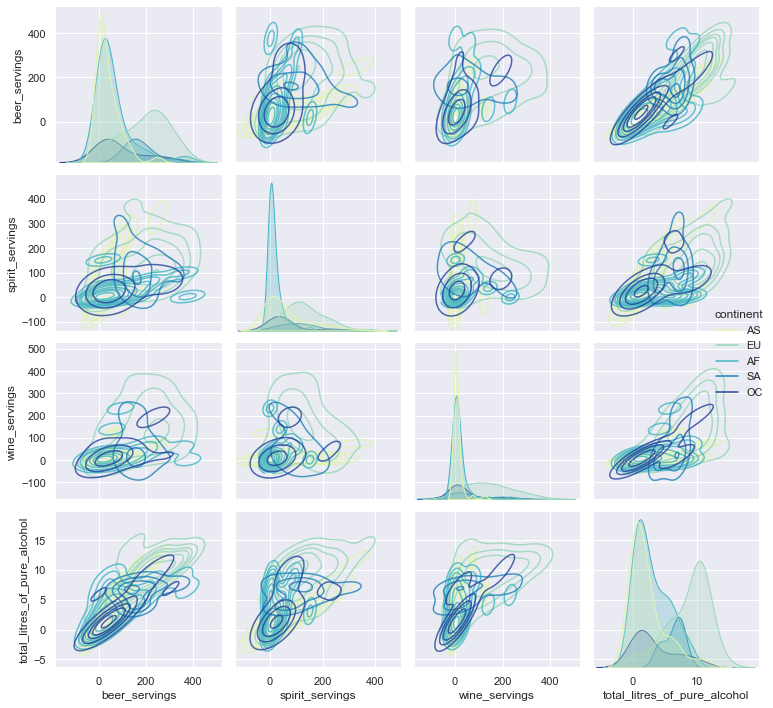

# Chapter 1.3 국가별 음주 데이터 분석


```python
import pandas as pd
import numpy as np
import matplotlib.pyplot as plt
```

(1) 데이터 기초 정보


```python
file_path = '../data/drinks.csv'
drinks = pd.read_csv(file_path, sep=",")
print(drinks.info())
drinks.head(10)
```

    <class 'pandas.core.frame.DataFrame'>
    RangeIndex: 193 entries, 0 to 192
    Data columns (total 6 columns):
     #   Column                        Non-Null Count  Dtype  
    ---  ------                        --------------  -----  
     0   country                       193 non-null    object 
     1   beer_servings                 193 non-null    int64  
     2   spirit_servings               193 non-null    int64  
     3   wine_servings                 193 non-null    int64  
     4   total_litres_of_pure_alcohol  193 non-null    float64
     5   continent                     170 non-null    object 
    dtypes: float64(1), int64(3), object(2)
    memory usage: 9.2+ KB
    None
    


<div>
<style scoped>
    .dataframe tbody tr th:only-of-type {
        vertical-align: middle;
    }

    .dataframe tbody tr th {
        vertical-align: top;
    }

    .dataframe thead th {
        text-align: right;
    }
</style>
<table border="1" class="dataframe">
  <thead>
    <tr style="text-align: right;">
      <th></th>
      <th>country</th>
      <th>beer_servings</th>
      <th>spirit_servings</th>
      <th>wine_servings</th>
      <th>total_litres_of_pure_alcohol</th>
      <th>continent</th>
    </tr>
  </thead>
  <tbody>
    <tr>
      <th>0</th>
      <td>Afghanistan</td>
      <td>0</td>
      <td>0</td>
      <td>0</td>
      <td>0.0</td>
      <td>AS</td>
    </tr>
    <tr>
      <th>1</th>
      <td>Albania</td>
      <td>89</td>
      <td>132</td>
      <td>54</td>
      <td>4.9</td>
      <td>EU</td>
    </tr>
    <tr>
      <th>2</th>
      <td>Algeria</td>
      <td>25</td>
      <td>0</td>
      <td>14</td>
      <td>0.7</td>
      <td>AF</td>
    </tr>
    <tr>
      <th>3</th>
      <td>Andorra</td>
      <td>245</td>
      <td>138</td>
      <td>312</td>
      <td>12.4</td>
      <td>EU</td>
    </tr>
    <tr>
      <th>4</th>
      <td>Angola</td>
      <td>217</td>
      <td>57</td>
      <td>45</td>
      <td>5.9</td>
      <td>AF</td>
    </tr>
    <tr>
      <th>5</th>
      <td>Antigua &amp; Barbuda</td>
      <td>102</td>
      <td>128</td>
      <td>45</td>
      <td>4.9</td>
      <td>NaN</td>
    </tr>
    <tr>
      <th>6</th>
      <td>Argentina</td>
      <td>193</td>
      <td>25</td>
      <td>221</td>
      <td>8.3</td>
      <td>SA</td>
    </tr>
    <tr>
      <th>7</th>
      <td>Armenia</td>
      <td>21</td>
      <td>179</td>
      <td>11</td>
      <td>3.8</td>
      <td>EU</td>
    </tr>
    <tr>
      <th>8</th>
      <td>Australia</td>
      <td>261</td>
      <td>72</td>
      <td>212</td>
      <td>10.4</td>
      <td>OC</td>
    </tr>
    <tr>
      <th>9</th>
      <td>Austria</td>
      <td>279</td>
      <td>75</td>
      <td>191</td>
      <td>9.7</td>
      <td>EU</td>
    </tr>
  </tbody>
</table>
</div>


```python
drinks.describe()
```


<div>
<style scoped>
    .dataframe tbody tr th:only-of-type {
        vertical-align: middle;
    }

    .dataframe tbody tr th {
        vertical-align: top;
    }

    .dataframe thead th {
        text-align: right;
    }
</style>
<table border="1" class="dataframe">
  <thead>
    <tr style="text-align: right;">
      <th></th>
      <th>beer_servings</th>
      <th>spirit_servings</th>
      <th>wine_servings</th>
      <th>total_litres_of_pure_alcohol</th>
    </tr>
  </thead>
  <tbody>
    <tr>
      <th>count</th>
      <td>193.000000</td>
      <td>193.000000</td>
      <td>193.000000</td>
      <td>193.000000</td>
    </tr>
    <tr>
      <th>mean</th>
      <td>106.160622</td>
      <td>80.994819</td>
      <td>49.450777</td>
      <td>4.717098</td>
    </tr>
    <tr>
      <th>std</th>
      <td>101.143103</td>
      <td>88.284312</td>
      <td>79.697598</td>
      <td>3.773298</td>
    </tr>
    <tr>
      <th>min</th>
      <td>0.000000</td>
      <td>0.000000</td>
      <td>0.000000</td>
      <td>0.000000</td>
    </tr>
    <tr>
      <th>25%</th>
      <td>20.000000</td>
      <td>4.000000</td>
      <td>1.000000</td>
      <td>1.300000</td>
    </tr>
    <tr>
      <th>50%</th>
      <td>76.000000</td>
      <td>56.000000</td>
      <td>8.000000</td>
      <td>4.200000</td>
    </tr>
    <tr>
      <th>75%</th>
      <td>188.000000</td>
      <td>128.000000</td>
      <td>59.000000</td>
      <td>7.200000</td>
    </tr>
    <tr>
      <th>max</th>
      <td>376.000000</td>
      <td>438.000000</td>
      <td>370.000000</td>
      <td>14.400000</td>
    </tr>
  </tbody>
</table>
</div>


(2) 탐색과 시각화


```python
# 단순 상관 분석 - 상관계수(r) 구하기  ** 결정계수: r^2
# 두 변수 간 선형적 관계를 표현(인과관계 설명x), 1에 가까울수록 강한 양의 상관관계가 있음
# -1 < 피어슨 상관계수 < 1
# pandas - corr() : 피처 간 상관 계수를 matrix 형태로 출력
```


```python
corr = drinks[['beer_servings', 'wine_servings']].corr(method='pearson')
print(corr)
```

                   beer_servings  wine_servings
    beer_servings       1.000000       0.527172
    wine_servings       0.527172       1.000000
    


```python
cols = drinks.columns[1:5].tolist()
# cols = drinks.columns.values
corr = drinks[cols].corr(method='pearson')
print(corr)
```

                                  beer_servings  spirit_servings  wine_servings  \
    beer_servings                      1.000000         0.458819       0.527172   
    spirit_servings                    0.458819         1.000000       0.194797   
    wine_servings                      0.527172         0.194797       1.000000   
    total_litres_of_pure_alcohol       0.835839         0.654968       0.667598   
    
                                  total_litres_of_pure_alcohol  
    beer_servings                                     0.835839  
    spirit_servings                                   0.654968  
    wine_servings                                     0.667598  
    total_litres_of_pure_alcohol                      1.000000  
    


```python
# Seaborn의 heatmap과 pairplot(산점도 그래프)으로 상관관계 분석하기
# 파라미터 -> heatmap: oorr.values(넘파이 배열 형태) // pairplot: 데이터 프레임
```


```python
import seaborn as sns
```


```python
#heatmap
```


```python
cols_view = ['beer', 'spirit', 'wine', 'alcohol']
sns.set(font_scale = 1.2)
hm = sns.heatmap(corr.values, cbar = True, annot = True, square = True, cmap="YlGnBu",
                 fmt = '.2f', annot_kws = {'size':10}, xticklabels = cols_view, yticklabels = cols_view)
```


    

    


```python
#산점도 그래프(pairplot)
```


```python
sns.set(style='darkgrid', context='notebook')
sns.pairplot(drinks, height = 2.5, kind="kde", plot_kws={'alpha':0.8}, hue='continent', palette='YlGnBu')
plt.tight_layout()
```


    

    


(3) 탐색적 분석


```python
# 결측데이터 전처리
```


```python
drinks['continent'].isna().sum()
drinks['continent'] = drinks['continent'].fillna('OT')
drinks.head(10)
```


<div>
<style scoped>
    .dataframe tbody tr th:only-of-type {
        vertical-align: middle;
    }

    .dataframe tbody tr th {
        vertical-align: top;
    }

    .dataframe thead th {
        text-align: right;
    }
</style>
<table border="1" class="dataframe">
  <thead>
    <tr style="text-align: right;">
      <th></th>
      <th>country</th>
      <th>beer_servings</th>
      <th>spirit_servings</th>
      <th>wine_servings</th>
      <th>total_litres_of_pure_alcohol</th>
      <th>continent</th>
    </tr>
  </thead>
  <tbody>
    <tr>
      <th>0</th>
      <td>Afghanistan</td>
      <td>0</td>
      <td>0</td>
      <td>0</td>
      <td>0.0</td>
      <td>AS</td>
    </tr>
    <tr>
      <th>1</th>
      <td>Albania</td>
      <td>89</td>
      <td>132</td>
      <td>54</td>
      <td>4.9</td>
      <td>EU</td>
    </tr>
    <tr>
      <th>2</th>
      <td>Algeria</td>
      <td>25</td>
      <td>0</td>
      <td>14</td>
      <td>0.7</td>
      <td>AF</td>
    </tr>
    <tr>
      <th>3</th>
      <td>Andorra</td>
      <td>245</td>
      <td>138</td>
      <td>312</td>
      <td>12.4</td>
      <td>EU</td>
    </tr>
    <tr>
      <th>4</th>
      <td>Angola</td>
      <td>217</td>
      <td>57</td>
      <td>45</td>
      <td>5.9</td>
      <td>AF</td>
    </tr>
    <tr>
      <th>5</th>
      <td>Antigua &amp; Barbuda</td>
      <td>102</td>
      <td>128</td>
      <td>45</td>
      <td>4.9</td>
      <td>OT</td>
    </tr>
    <tr>
      <th>6</th>
      <td>Argentina</td>
      <td>193</td>
      <td>25</td>
      <td>221</td>
      <td>8.3</td>
      <td>SA</td>
    </tr>
    <tr>
      <th>7</th>
      <td>Armenia</td>
      <td>21</td>
      <td>179</td>
      <td>11</td>
      <td>3.8</td>
      <td>EU</td>
    </tr>
    <tr>
      <th>8</th>
      <td>Australia</td>
      <td>261</td>
      <td>72</td>
      <td>212</td>
      <td>10.4</td>
      <td>OC</td>
    </tr>
    <tr>
      <th>9</th>
      <td>Austria</td>
      <td>279</td>
      <td>75</td>
      <td>191</td>
      <td>9.7</td>
      <td>EU</td>
    </tr>
  </tbody>
</table>
</div>


```python
# 파이차트로 시각화하기
```


```python
#drinks['continent'].unique().tolist()
labels = drinks['continent'].value_counts().index.tolist()
fracs1 = drinks['continent'].value_counts().values.tolist()
explode=(0.05,0.05,0.05,0.25,0.05,0.05)
#colors = ['#c4f8fe', '#ffadad', '#cafec4', '#fef4c4', '#d5c4fe', '#f7fec4']
cmap = plt.get_cmap('Accent')
colors = [cmap(i) for i in np.linspace(0, 1, 7)]
plt.pie(fracs1, explode= explode, labels = labels, autopct = "%.0f%%", shadow= False, colors=colors, radius=1) #wedgeprops=["linewidth":2, "edgecolor":"black"]

#donut
centre_circle = plt.Circle((0,0),0.4, color='black', fc='white',linewidth=0)
fig = plt.gcf()
fig.gca().add_artist(centre_circle)

plt.title('null data to \'OT\'')
plt.show()
```


    

    


```python
# 대륙별 spirit_servings의 통계적 정보
#agg() 함수 이용
result = drinks.groupby('continent').spirit_servings.agg(['mean', 'min', 'max', 'sum'])
result.head()
```


<div>
<style scoped>
    .dataframe tbody tr th:only-of-type {
        vertical-align: middle;
    }

    .dataframe tbody tr th {
        vertical-align: top;
    }

    .dataframe thead th {
        text-align: right;
    }
</style>
<table border="1" class="dataframe">
  <thead>
    <tr style="text-align: right;">
      <th></th>
      <th>mean</th>
      <th>min</th>
      <th>max</th>
      <th>sum</th>
    </tr>
    <tr>
      <th>continent</th>
      <th></th>
      <th></th>
      <th></th>
      <th></th>
    </tr>
  </thead>
  <tbody>
    <tr>
      <th>AF</th>
      <td>16.339623</td>
      <td>0</td>
      <td>152</td>
      <td>866</td>
    </tr>
    <tr>
      <th>AS</th>
      <td>60.840909</td>
      <td>0</td>
      <td>326</td>
      <td>2677</td>
    </tr>
    <tr>
      <th>EU</th>
      <td>132.555556</td>
      <td>0</td>
      <td>373</td>
      <td>5965</td>
    </tr>
    <tr>
      <th>OC</th>
      <td>58.437500</td>
      <td>0</td>
      <td>254</td>
      <td>935</td>
    </tr>
    <tr>
      <th>OT</th>
      <td>165.739130</td>
      <td>68</td>
      <td>438</td>
      <td>3812</td>
    </tr>
  </tbody>
</table>
</div>


```python
#전체 평균보다 많은 알코올 섭취하는 대륙은?
total_mean = drinks.total_litres_of_pure_alcohol.mean()
continent_mean = drinks.groupby('continent')['total_litres_of_pure_alcohol'].mean()
continent_over_mean = continent_mean[continent_mean>total_mean]
print(continent_over_mean)
```

    continent
    EU    8.617778
    OT    5.995652
    SA    6.308333
    Name: total_litres_of_pure_alcohol, dtype: float64
    


```python
#평균 beer_servings 가 가장 높은 대륙은?
beer_continent = drinks.groupby('continent').beer_servings.mean().idxmax()
print(beer_continent)
```

    EU
    


```python
# 시각화 (막대그래프) - 대륙별 spirit_servings 의 평균, 최소, 최대, 합계
```


```python
n_groups = len(result.index)
means = result['mean'].tolist()
mins = result['min'].tolist()
maxs = result['max'].tolist()
sums = result['sum'].tolist()

index = np.arange(n_groups)
bar_width=0.1

rects1 = plt.bar(index, means, bar_width, color='r', label='Mean')
rects2 = plt.bar(index+bar_width, mins, bar_width, color='g', label='Min')
rects3 = plt.bar(index+bar_width*2, maxs, bar_width, color='b', label='Max')
rects4 =plt.bar(index+bar_width*3, sums, bar_width, color='y', label='Sum')

plt.xticks(index, result.index.tolist())
plt.legend(loc="upper right")
plt.show()
```


    

    


```python
#notebook에서 command 창 명령 실행
### !pip install seaborn
```


인사이트 도출1: 대륙별 평균 wine_servings 탐색


```python
continent_mean_wine = drinks.groupby('continent').wine_servings.mean()
print(continent_mean_wine)
```

    continent
    AF     16.264151
    AS      9.068182
    EU    142.222222
    OC     35.625000
    OT     24.521739
    SA     62.416667
    Name: wine_servings, dtype: float64
    

인사이트 도출2: 전체 평균보다 적은 알코올을 섭취하는 대륙


```python
alcohol_mean = drinks.total_litres_of_pure_alcohol.mean()
print("전체평균: ", alcohol_mean)

print()
continent_alcohol_mean = drinks.groupby('continent').total_litres_of_pure_alcohol.mean()
print("대륙별 알코올 섭취 평균: ", continent_alcohol_mean)

print()
print("평균보다 적은 알코올 섭취 국가: ", continent_alcohol_mean[continent_alcohol_mean<alcohol_mean])

```

    전체평균:  4.717098445595855
    
    대륙별 알코올 섭취 평균:  continent
    AF    3.007547
    AS    2.170455
    EU    8.617778
    OC    3.381250
    OT    5.995652
    SA    6.308333
    Name: total_litres_of_pure_alcohol, dtype: float64
    
    평균보다 적은 알코올 섭취 국가:  continent
    AF    3.007547
    AS    2.170455
    OC    3.381250
    Name: total_litres_of_pure_alcohol, dtype: float64
    


```python
#대륙별 total_litres_of_pure_alcohol 시각화하기

continents = continent_alcohol_mean.index.tolist()

continents.append('mean')
x_pos = np.arange(len(continents))
alcohol = continent_alcohol_mean.values.tolist()
alcohol.append(alcohol_mean)

bar_list = plt.bar(x_pos, alcohol, align='center', alpha =0.7)
bar_list[len(continents)-1].set_color('r')
plt.plot([0,6],[alcohol_mean,alcohol_mean], "r--")
plt.xticks(x_pos, continents)

plt.ylabel('total_litres_of_pure_alcohol')
plt.title('total_litres_of_pure_alcohol by Continent')

```


    Text(0.5, 1.0, 'total_litres_of_pure_alcohol by Continent')


    

    


```python
# t-test
# scipy - ttest_ind()로 검정 결과 확인
# 두 집단 간 평균 차에 대한 검정 : 모집단의 평균 모를 때 (두 집단의 데이터가 정규 분포를 보일 때 신뢰도가 높은 검정 방식)
```


```python
# 아프리카와 유럽 간 맥주 소비량 차이 검정
africa = drinks.loc[drinks['continent']=='AF']
europe = drinks.loc[drinks['continent']=='EU']

from scipy import stats
tTestResult = stats.ttest_ind(africa['beer_servings'], europe['beer_servings'])
tTestResultDiffVar = stats.ttest_ind(africa['beer_servings'], europe['beer_servings'], equal_var = False)

# p-value: 귀무 가설이 맞다는 전제 하에 현재 나온 통계값 이상이 나올 확률 : 기준보다 낮으면 귀무가설 기각, 결과 차이는 통계적으로 유의미
# -> 두 집단의 평균이 다르다.
print("The t-statistic and p-value assuming equal variance is %.3f and %.3f."%tTestResult)
print("The t-statistic and p-value assuming equal variance is %.3f and %.3f."%tTestResultDiffVar)
```

    The t-statistic and p-value assuming equal variance is -7.268 and 0.000.
    The t-statistic and p-value assuming equal variance is -7.144 and 0.000.
    


```python
# 대한민국은 얼마나 술을 마시나?
drinks['total_servings']=drinks['beer_servings']+drinks['wine_servings']+drinks['spirit_servings']
# 열 삭제
# drinks = drinks.drop(['total_servings'], axis=1)
drinks['alcohol_rate'] = drinks['total_litres_of_pure_alcohol']/drinks['total_servings']
drinks['alcohol_rate']=drinks['alcohol_rate'].fillna(0)
country_with_rank = drinks.sort_values(by=['alcohol_rate'], ascending=False)
```


```python
# 국가별 순위 정보 시각화
country_list = country_with_rank.country.tolist()
x_pos = np.arange(len(country_list))
rank = country_with_rank.alcohol_rate.tolist()

bar_list = plt.bar(x_pos, rank)
bar_list[country_list.index("South Korea")].set_color('r')
plt.ylabel('alcohol rate')
plt.title('liquor drink rank by country')
plt.axis([0,200,0,0.3])

korea_rank = country_list.index("South Korea")
korea_alcohol_rate = country_with_rank[country_with_rank['country']=='South Korea']['alcohol_rate'].values[0]
plt.annotate('South Korea: '+str(korea_rank+1),
            xy = (korea_rank, korea_alcohol_rate),
            xytext = (korea_rank+30, korea_alcohol_rate+0.05),
            arrowprops = dict(facecolor='red', shrink=0.05))
```


    Text(44, 0.1093939393939394, 'South Korea: 15')


    

    


```python

```

